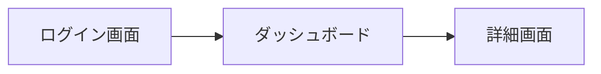

# BSD-003 画面設計書（ワイヤーフレーム）テンプレート

## セクション構成

```markdown
## 1. 画面設計方針

### 1.1 UIフレームワーク・デザインシステム
（REQ-001 または BSD-001 の技術スタックから）

### 1.2 レスポンシブ対応
- 対応デバイス: PC / タブレット / スマートフォン
- ブレークポイント:

### 1.3 共通デザイン規則
- カラーパレット:
- フォント・タイポグラフィ:
- アイコンセット:
- グリッドシステム:

---

## 2. 画面一覧

（REQ-004 の画面一覧から転記・整理）

| 画面ID | 画面名 | URL/パス | 説明 | 遷移元 | 遷移先 |
|---|---|---|---|---|---|
| SCR-001 | | | | | |
| SCR-002 | | | | | |

---

## 3. 画面遷移図

（Mermaid の flowchart または stateDiagram で画面遷移を図示）



---

## 4. 共通コンポーネント

| コンポーネント名 | 説明 | 使用画面 |
|---|---|---|
| ヘッダー | グローバルナビゲーション・ユーザー情報 | 全画面 |
| フッター | フッターリンク | 全画面 |
| サイドバー | | |
| モーダル | | |
| テーブル | データ一覧表示 | |
| フォーム | 入力フォーム共通スタイル | |

---

## 5. 画面別ワイヤーフレーム

### 5.1 {画面ID}: {画面名}

**URL**: `/{パス}`
**アクター**: {対象ユーザー}
**概要**: {REQ-003 のユースケースから}

**レイアウト（ASCII ワイヤーフレーム）:**
```
+----------------------------------+
| ヘッダー                          |
+----------------------------------+
| [フォーム項目1]   [フォーム項目2]  |
| [フォーム項目3]                   |
|                    [送信ボタン]   |
+----------------------------------+
| フッター                          |
+----------------------------------+
```

**主要コンポーネント:**
- 入力項目: {項目名}（必須/任意）
- ボタン: {ボタン名} → {遷移先}
- バリデーション: {ルール}

**エラー表示:**
- {エラーケース}: {メッセージ}

（画面数分繰り返す）

---

## 6. 後続フェーズへの影響

| 影響先 | 内容 |
|---|---|
| DSD-002 | フロントエンド詳細設計でのコンポーネント実装 |
```
