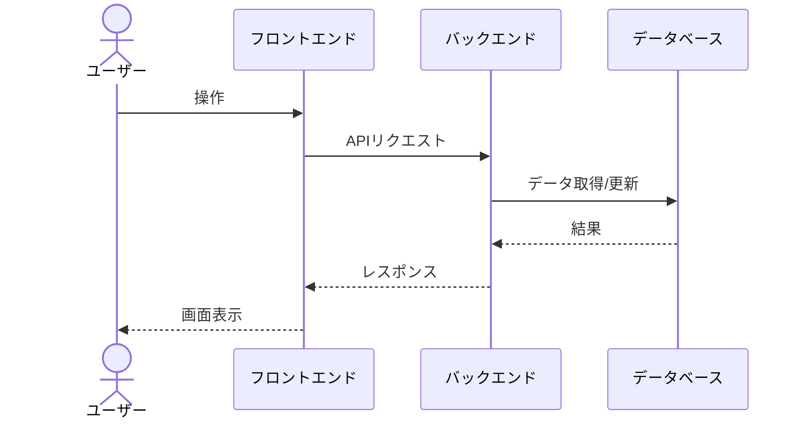

# BSD-004 業務フロー設計書 テンプレート

## セクション構成

```markdown
## 1. 業務フロー設計方針

### 1.1 対象業務の概要
（REQ-002 の業務要件から）

### 1.2 アクター一覧

| アクターID | アクター名 | 役割 |
|---|---|---|
| ACT-001 | | |

---

## 2. 業務フロー一覧

| フローID | 業務フロー名 | 対象アクター | 関連ユースケース |
|---|---|---|---|
| BF-001 | | | REQ-003: UC-XXX |

---

## 3. 業務フロー詳細

### 3.1 {フローID}: {業務フロー名}

**目的**: {REQ-002 から}
**トリガー**: {開始条件}
**終了条件**: {正常終了・異常終了}

**フロー図（シーケンス図）:**


**正常フロー（主フロー）:**
1. {ステップ1}
2. {ステップ2}

**代替フロー:**
- {条件}: {フロー}

**例外フロー:**
- {エラーケース}: {システムの振る舞い}

**業務ルール:**
- {ルール1}
- {ルール2}

（フロー数分繰り返す）

---

## 4. フロントエンド/バックエンド連携概要

| 業務処理 | フロントエンドの役割 | バックエンドの役割 | API概要 |
|---|---|---|---|
| | | | |

---

## 5. 後続フェーズへの影響

| 影響先 | 内容 |
|---|---|
| DSD-001 | バックエンド処理フローの詳細設計 |
| DSD-002 | フロントエンドのUIロジック設計 |
```
