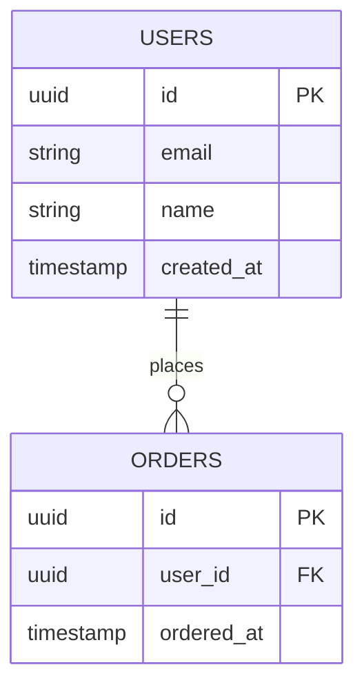

# BSD-006 データベース基本設計書 テンプレート

## セクション構成

```markdown
## 1. データベース設計方針

### 1.1 使用DBMS
（REQ-001 または BSD-001 から）
- DBMS: （例: PostgreSQL 15）
- 文字コード: UTF-8
- タイムゾーン: Asia/Tokyo

### 1.2 設計方針
- 正規化レベル: 第3正規形を基本とする
- 論理削除: 採用 / 非採用 （採用の場合: `deleted_at` カラム）
- 監査カラム: `created_at`, `updated_at`, `created_by`, `updated_by`
- ID方針: UUID / 連番 / ULID など

---

## 2. ER図（概念レベル）

（Mermaid の erDiagram でエンティティと関係を図示）



---

## 3. テーブル一覧

（REQ-005 の機能一覧・REQ-007 の外部IFから）

| テーブル名 | 論理名 | 概要 | 関連FEAT-ID |
|---|---|---|---|
| `users` | ユーザー | システム利用者情報 | FEAT-XXX |
| `orders` | 注文 | 注文情報 | FEAT-XXX |

---

## 4. テーブル定義（主要テーブル）

### 4.1 `{テーブル名}`（{論理名}）

**概要**: {テーブルの役割}

| カラム名 | 型 | 制約 | 説明 |
|---|---|---|---|
| `id` | UUID | PK, NOT NULL | 主キー |
| `name` | VARCHAR(255) | NOT NULL | 名称 |
| `created_at` | TIMESTAMP | NOT NULL, DEFAULT NOW() | 作成日時 |
| `updated_at` | TIMESTAMP | NOT NULL | 更新日時 |
| `deleted_at` | TIMESTAMP | NULL | 論理削除日時 |

**インデックス:**
| インデックス名 | カラム | 種別 | 用途 |
|---|---|---|---|
| `idx_{table}_email` | `email` | UNIQUE | メール検索 |

（テーブル数分繰り返す）

---

## 5. データモデル方針

### 5.1 マイグレーション方針
- マイグレーションツール: （例: Flyway / Liquibase / Alembic）
- 命名規則: `V{version}__{description}.sql`
- ロールバック対応: 有 / 無

### 5.2 シーディング（初期データ）
- マスタデータの種類と管理方針:

### 5.3 バックアップ方針
（概要のみ。詳細は OPS-004 で定義）

---

## 6. 後続フェーズへの影響

| 影響先 | 内容 |
|---|---|
| DSD-004 | 機能別のテーブル詳細定義・インデックス詳細 |
| IMP-004 | DBマイグレーション手順書 |
| OPS-004 | バックアップ・リストア手順書 |
```
