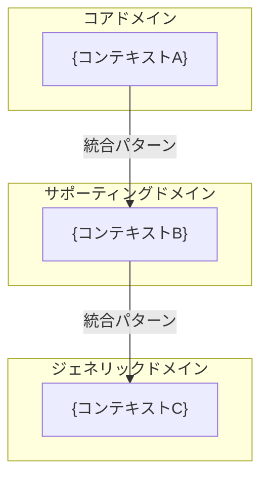

# BSD-009 ドメインモデル設計書（DDD 戦略設計）テンプレート

> このドキュメントはシステム共通（FEAT-IDなし）。
> 保存先: `docs/BSD/BSD-009_domain-model.md`
> 入力元: REQ-002, REQ-003, REQ-005, REQ-008

## 目次
1. ユビキタス言語辞書
2. 境界づけられたコンテキストマップ
3. コンテキスト定義詳細
4. コンテキスト間統合パターン
5. サブドメイン分類
6. 後続フェーズへの影響

---

## セクション構成

```markdown
## 1. ユビキタス言語辞書

> REQ-008（用語定義書）を拡張し、境界づけられたコンテキスト別に整理する。
> 同一用語がコンテキストによって異なる意味を持つ場合は、コンテキストごとに定義を分離する。

### 1.1 全体共通用語

| 用語（日本語） | 用語（英語） | 定義 | 備考 |
|---|---|---|---|
| | | | REQ-008 より |

### 1.2 コンテキスト別用語

#### {コンテキスト名}

| 用語（日本語） | 用語（英語） | このコンテキストでの定義 | 他コンテキストとの違い |
|---|---|---|---|
| | | | |

（コンテキスト数分繰り返す）

---

## 2. 境界づけられたコンテキストマップ

### 2.1 コンテキストマップ図



### 2.2 コンテキスト一覧

| コンテキストID | コンテキスト名 | サブドメイン分類 | 主要責務 | 含有 FEAT-ID |
|---|---|---|---|---|
| CTX-001 | | コア / サポーティング / ジェネリック | | FEAT-XXX, FEAT-YYY |

---

## 3. コンテキスト定義詳細

### 3.1 {コンテキストID}: {コンテキスト名}

**責務**: {このコンテキストが担うビジネス上の責務}
**サブドメイン分類**: コア / サポーティング / ジェネリック

**含有 FEAT-ID:**
| FEAT-ID | 機能名 | 役割 |
|---|---|---|
| FEAT-XXX | | |

**主要エンティティ:**
| エンティティ名 | 役割 | 集約ルート候補 |
|---|---|---|
| | | はい / いいえ |

**ドメインルール概要:**
- {不変条件1}
- {不変条件2}

**ドメインイベント概要:**
| イベント名 | トリガー | 影響先コンテキスト |
|---|---|---|
| | | |

（コンテキスト数分繰り返す）

---

## 4. コンテキスト間統合パターン

### 4.1 統合パターン一覧

| 上流コンテキスト | 下流コンテキスト | 統合パターン | データ連携方式 | 説明 |
|---|---|---|---|---|
| CTX-XXX | CTX-YYY | Shared Kernel / Customer-Supplier / Conformist / ACL / Open Host Service / Published Language | 同期API / 非同期イベント / 共有DB | |

### 4.2 統合パターン詳細

#### {上流コンテキスト} → {下流コンテキスト}

**パターン**: {選択した統合パターン}
**選定理由**: {パターン選定の根拠}

**データ連携:**
- 連携方式: {同期API / 非同期イベント / 共有DB}
- 連携データ: {交換するデータの概要}
- 変換ルール: {データ変換が必要な場合のルール}
- 障害時の振る舞い: {タイムアウト・リトライ・フォールバック方針}

（統合数分繰り返す）

---

## 5. サブドメイン分類

### 5.1 分類表

| サブドメイン | 分類 | コンテキスト | 投資方針 | 実装戦略 |
|---|---|---|---|---|
| | コア | CTX-XXX | 最大投資・独自実装 | DDD戦術パターンをフル適用 |
| | サポーティング | CTX-YYY | 適度な投資 | 簡易なドメインモデル or トランザクションスクリプト |
| | ジェネリック | CTX-ZZZ | 最小投資 | 既製ライブラリ / SaaS 活用 |

### 5.2 分類の根拠

#### コアドメイン
- {このシステムの競争優位性を生むドメイン}
- 選定理由: {なぜコアなのか}

#### サポーティングドメイン
- {コアを支援するが差別化要因ではないドメイン}
- 選定理由: {なぜサポーティングなのか}

#### ジェネリックドメイン
- {どのシステムにも共通する汎用的なドメイン}
- 選定理由: {なぜジェネリックなのか}

---

## 6. 後続フェーズへの影響

| 影響先 | 内容 |
|---|---|
| BSD-010 | データアーキテクチャのコンテキスト別データオーナーシップ定義の前提 |
| BSD-006 | テーブルの集約単位グループ化・スキーマ所有権の前提 |
| DSD-009_{FEAT-ID} | 各機能のドメインモデル詳細設計（集約・エンティティ・値オブジェクト・ドメインイベント）の前提 |
| DSD-001_{FEAT-ID} | バックエンドの DDD レイヤード構成・ドメインオブジェクト配置の前提 |
| DSD-004_{FEAT-ID} | 集約-テーブルマッピングの前提 |
| DSD-007 | DDD 実装規約の前提 |
```
