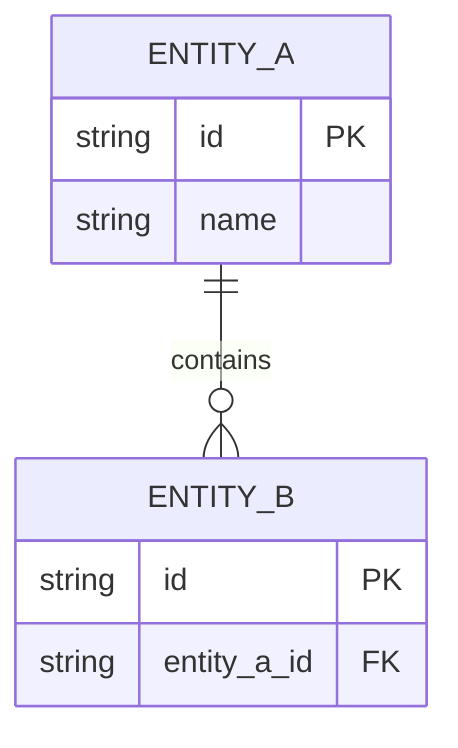
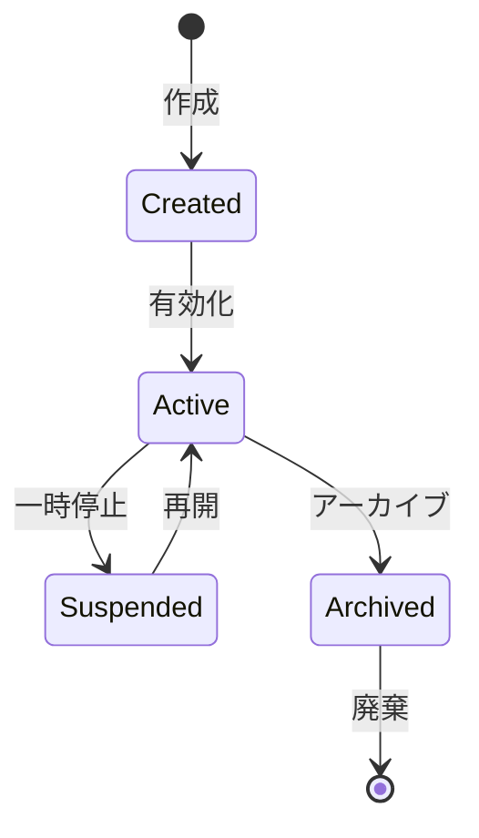
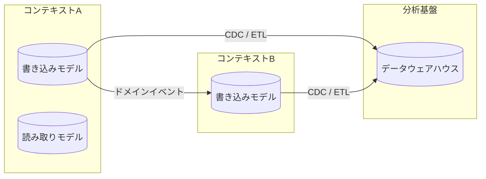

# BSD-010 データアーキテクチャ設計書 テンプレート

> このドキュメントはシステム共通（FEAT-IDなし）。
> 保存先: `docs/BSD/BSD-010_data-architecture.md`
> 入力元: REQ-005, REQ-006, REQ-007, BSD-006, BSD-009

## 目次
1. データ戦略概要
2. 概念データモデル
3. データフローアーキテクチャ
4. データライフサイクル管理
5. 分析基盤設計
6. データ品質・ガバナンス
7. 後続フェーズへの影響

---

## セクション構成

```markdown
## 1. データ戦略概要

### 1.1 データファースト設計方針
- データモデルを先に設計し、アプリケーション層はデータモデルに従う
- ビジネスデータのライフサイクル全体（生成→利用→保管→廃棄）を設計対象とする
- BSD-009 で定義したコンテキスト境界に基づくデータオーナーシップを確立する

### 1.2 データオーナーシップ

| コンテキスト（BSD-009） | オーナーシップ対象データ | 読み取り許可コンテキスト | 書き込み権限 |
|---|---|---|---|
| CTX-XXX | {データ群} | CTX-YYY, CTX-ZZZ | CTX-XXX のみ |

### 1.3 データ分類

| データ分類 | 説明 | 例 | 保護レベル |
|---|---|---|---|
| マスタデータ | 業務の基盤となる参照データ | ユーザー、商品、カテゴリ | 高 |
| トランザクションデータ | 業務活動の記録 | 注文、支払い、ログ | 高 |
| 分析データ | 集計・レポート用の派生データ | 売上サマリ、KPIメトリクス | 中 |
| 一時データ | セッション・キャッシュ等 | セッション情報、一時ファイル | 低 |

---

## 2. 概念データモデル

### 2.1 ビジネスエンティティ関連図

> BSD-009 のコンテキスト境界を反映した概念レベルの ER 図。
> テーブル設計（BSD-006）の前段階としてビジネス観点でのエンティティ関係を定義する。



### 2.2 エンティティライフサイクル状態遷移

#### {エンティティ名}



| 状態 | 説明 | 遷移条件 | データ保持方針 |
|---|---|---|---|
| Created | 初期状態 | エンティティ生成時 | OLTP テーブルに保持 |
| Active | 有効状態 | 有効化処理実行時 | OLTP テーブルに保持 |
| Archived | アーカイブ済み | 一定期間経過後 | アーカイブテーブルに移行 |

（主要エンティティ数分繰り返す）

---

## 3. データフローアーキテクチャ

### 3.1 コンテキスト間データフロー図



### 3.2 データ連携方式一覧

| 連携元 | 連携先 | 方式 | 頻度 | データ量目安 | 整合性保証 |
|---|---|---|---|---|---|
| CTX-XXX | CTX-YYY | 非同期イベント | リアルタイム | 低〜中 | 結果整合性 |
| CTX-XXX | DWH | CDC / バッチETL | 日次 / リアルタイム | 高 | 結果整合性 |

### 3.3 CQRS / イベントソーシング適用判断

| コンテキスト | CQRS 適用 | イベントソーシング適用 | 判断理由 |
|---|---|---|---|
| CTX-XXX | 適用 / 不適用 | 適用 / 不適用 | {理由} |

> **CQRS 適用基準**: 読み取りと書き込みのスケーリング要件が大きく異なる場合、または読み取りモデルの非正規化が必要な場合に適用を検討する。
> **イベントソーシング適用基準**: 完全な監査証跡が必要、状態の時系列再構築が求められる、またはドメインイベントが設計の中心である場合に適用を検討する。

---

## 4. データライフサイクル管理

### 4.1 データ保持ポリシー

| データ分類 | エンティティ例 | OLTP保持期間 | アーカイブ期間 | 完全削除タイミング | 法的根拠 |
|---|---|---|---|---|---|
| トランザクション | 注文 | 1年 | 7年 | 8年後 | {関連法規} |
| ログ | アクセスログ | 90日 | 1年 | 1年後 | {関連法規} |
| 個人情報 | ユーザー情報 | アクティブ期間 | 退会後6ヶ月 | 退会後6ヶ月 | 個人情報保護法 |

### 4.2 アーカイブ方針
- アーカイブ方式: {テーブルパーティション / 別テーブル移行 / オブジェクトストレージ移行}
- アーカイブ実行タイミング: {日次バッチ / 月次バッチ}
- アーカイブデータへのアクセス: {読み取り専用API / 管理画面 / 直接クエリ}

### 4.3 匿名化・仮名化
- 対象データ: {個人情報を含むエンティティ}
- 匿名化手法: {マスキング / ハッシュ化 / 一般化 / k-匿名化}
- 適用タイミング: {アーカイブ時 / 分析基盤投入時}

### 4.4 監査証跡設計
- 監査対象操作: {CRUD すべて / 更新・削除のみ}
- 監査ログ保持期間: {法的要件に基づく期間}
- 監査ログ形式: {テーブル / イベントログ / 外部監査サービス}

---

## 5. 分析基盤設計

### 5.1 OLTP/OLAP 分離戦略

| 観点 | OLTP（トランザクション処理） | OLAP（分析処理） |
|---|---|---|
| データベース | {RDBMS} | {DWH / 分析DB} |
| データモデル | 正規化（3NF） | 非正規化（スタースキーマ等） |
| 更新頻度 | リアルタイム | バッチ / ニアリアルタイム |
| クエリパターン | ポイントクエリ（単一レコード操作） | 集計クエリ（大量レコードスキャン） |

### 5.2 マテリアライズドビュー戦略

| ビュー名 | 元テーブル | 更新頻度 | 用途 |
|---|---|---|---|
| `mv_{name}` | {元テーブル} | {リアルタイム / 日次 / 時間ごと} | {ダッシュボード / レポート / API高速化} |

### 5.3 データウェアハウス連携

| 連携方式 | ツール | スケジュール | 対象データ |
|---|---|---|---|
| CDC | {Debezium / DMS 等} | リアルタイム | {テーブル一覧} |
| バッチETL | {Airflow / Step Functions 等} | {日次 / 時間ごと} | {テーブル一覧} |

---

## 6. データ品質・ガバナンス

### 6.1 バリデーション層設計

| バリデーション層 | 実施場所 | 対象 | 手法 |
|---|---|---|---|
| 入力バリデーション | プレゼンテーション層 | ユーザー入力 | フォームバリデーション・DTO バリデーション |
| ドメインバリデーション | ドメイン層 | ビジネスルール | エンティティ不変条件・値オブジェクト制約 |
| データ整合性 | インフラ層（DB） | データ制約 | NOT NULL・UNIQUE・FK・CHECK 制約 |
| クロスコンテキスト整合性 | アプリケーション層 | コンテキスト間データ | Saga パターン / 結果整合性チェック |

### 6.2 整合性モデル

| コンテキスト間 | 整合性モデル | 許容遅延 | 補償トランザクション |
|---|---|---|---|
| CTX-XXX ↔ CTX-YYY | 結果整合性 | 数秒 | {補償処理の概要} |

### 6.3 マスタデータ管理

| マスタデータ | オーナーコンテキスト | 配布方式 | 同期頻度 |
|---|---|---|---|
| {マスタ名} | CTX-XXX | {イベント / API / 共有DB} | {リアルタイム / 日次} |

---

## 7. 後続フェーズへの影響

| 影響先 | 内容 |
|---|---|
| BSD-006 | テーブル設計のコンテキスト対応・スキーマ分離・集約グループ化方針 |
| DSD-004_{FEAT-ID} | データライフサイクル設計・分析モデル設計・マテリアライズドビュー詳細 |
| DSD-009_{FEAT-ID} | ドメインモデル詳細設計におけるデータフロー・イベント設計の前提 |
| DSD-006_{FEAT-ID} | バッチ・非同期処理のデータ連携方式詳細 |
| IMP-004 | マイグレーション手順のアーカイブ・監査テーブル考慮 |
| OPS-004 | バックアップ対象・保持期間・アーカイブ運用の前提 |
```
