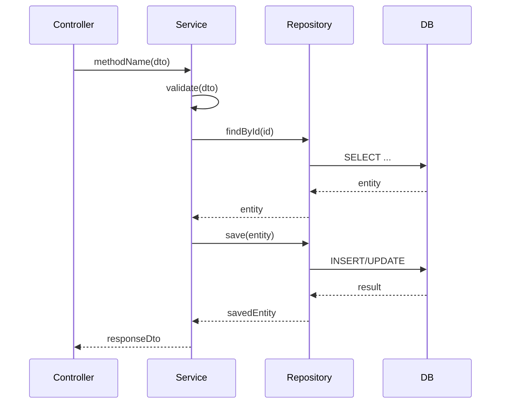

# DSD-001 バックエンド機能詳細設計書 テンプレート

## 目次
1. モジュール構成
2. クラス・関数設計
3. シーケンス図
4. 処理フロー詳細
5. エラーハンドリング
6. ログ設計
7. 後続フェーズへの影響

---

## セクション構成

```markdown
## 1. モジュール構成

### 1.1 ディレクトリ構成
（BSD-001 の技術スタック・フォルダ構成から、この機能に関わるファイルパスを列挙）

```
src/
├── {domain}/
│   ├── {feature}/
│   │   ├── {feature}.controller.ts   # HTTPリクエスト受付
│   │   ├── {feature}.service.ts      # ビジネスロジック
│   │   ├── {feature}.repository.ts   # DB アクセス
│   │   ├── {feature}.dto.ts          # リクエスト/レスポンス型定義
│   │   └── {feature}.entity.ts       # DBエンティティ
```

### 1.2 責務分担

| ファイル | 責務 |
|---|---|
| `*.controller` | ルーティング・リクエスト受付・レスポンス返却 |
| `*.service` | ビジネスロジック・トランザクション制御 |
| `*.repository` | DB操作（CRUD）の抽象化 |

---

## 2. クラス・関数設計

### 2.1 {ClassName}

**役割**: {責務の説明}

| メソッド名 | 引数 | 戻り値 | 説明 |
|---|---|---|---|
| `methodName(param: Type)` | `param: Type` | `Promise<ReturnType>` | 処理の説明 |

**主要ロジック:**
```typescript
// 擬似コードまたは概要コード
async methodName(param: ParamType): Promise<ReturnType> {
  // 1. バリデーション
  // 2. ビジネスルール適用
  // 3. DB操作
  // 4. 結果返却
}
```

（クラス数分繰り返す）

---

## 3. シーケンス図

（BSD-004 の業務フローを参照し、このFEAT-IDに該当する処理のシーケンスを詳細化）



---

## 4. 処理フロー詳細

### 4.1 {主要処理名}

**前提条件:** {処理開始前に満たすべき条件}
**トリガー:** {APIコール / イベント / スケジュール}

| ステップ | 処理内容 | 担当クラス | 備考 |
|---|---|---|---|
| 1 | リクエスト受信・バリデーション | Controller | DTO バリデーション |
| 2 | 認証・認可チェック | AuthGuard | JWT検証 |
| 3 | ビジネスルール適用 | Service | |
| 4 | DB操作 | Repository | トランザクション内 |
| 5 | レスポンス生成 | Controller | |

**業務ルール:**
- {ルール1}
- {ルール2}

**トランザクション境界:**
- 開始: {処理ステップ}
- コミット: {条件}
- ロールバック: {条件}

---

## 5. エラーハンドリング

| エラー種別 | 発生条件 | 対処 | HTTPステータス | エラーコード |
|---|---|---|---|---|
| バリデーションエラー | 入力値不正 | 400を返す | 400 | `VALIDATION_ERROR` |
| リソース未存在 | IDが存在しない | 404を返す | 404 | `NOT_FOUND` |
| 権限エラー | 認可失敗 | 403を返す | 403 | `FORBIDDEN` |
| DB エラー | DB接続・クエリ失敗 | 500を返しログ記録 | 500 | `INTERNAL_ERROR` |
| 外部API エラー | タイムアウト等 | リトライ→失敗時500 | 500 | `EXTERNAL_ERROR` |

---

## 6. ログ設計

| ログレベル | 出力タイミング | 出力内容 | 個人情報マスク |
|---|---|---|---|
| INFO | リクエスト受信・レスポンス送信 | メソッド名・ステータスコード・処理時間 | - |
| DEBUG | ビジネスロジック主要ステップ | 処理パラメータ | メールアドレス等をマスク |
| WARN | リトライ発生・低優先度エラー | エラー内容・リトライ回数 | - |
| ERROR | 例外発生・処理失敗 | スタックトレース・入力パラメータ（マスク済） | 要マスク |

---

## 7. 後続フェーズへの影響

| 影響先 | 内容 |
|---|---|
| IMP-001_{FEAT-ID} | 本設計に基づく実装 |
| UT-001_{FEAT-ID} | テスト対象クラス・メソッドの網羅 |
| DSD-008_{FEAT-ID} | 単体テスト設計の入力 |
```
