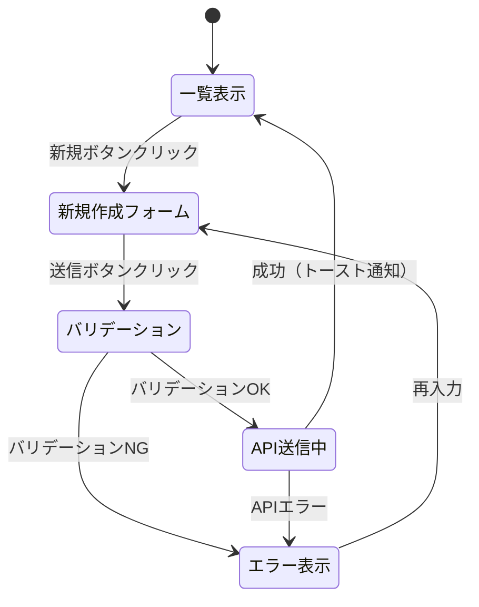

# DSD-002 フロントエンド詳細設計書 テンプレート

## 目次
1. コンポーネント構成
2. 状態管理設計
3. ルーティング設計
4. UIロジック詳細
5. API通信設計
6. エラーハンドリング・ローディング
7. 後続フェーズへの影響

---

## セクション構成

```markdown
## 1. コンポーネント構成

### 1.1 コンポーネントツリー

（BSD-003 の画面設計・コンポーネント定義から、このFEATに関わるものを詳細化）

```
{FeaturePage}                        # ページコンポーネント（ルート）
├── {FeatureHeader}                  # ヘッダー部
├── {FeatureList}                    # 一覧表示
│   └── {FeatureListItem}            # 一覧アイテム
├── {FeatureForm}                    # 入力フォーム
│   ├── {FormField}                  # フォームフィールド（共通）
│   └── {SubmitButton}               # 送信ボタン
└── {FeatureModal}                   # モーダルダイアログ
```

### 1.2 コンポーネント一覧

| コンポーネント名 | ファイルパス | 種別 | 説明 |
|---|---|---|---|
| `{FeaturePage}` | `src/pages/{feature}/index.tsx` | Page | ページ全体のレイアウト管理 |
| `{FeatureList}` | `src/components/{feature}/List.tsx` | UI | データ一覧表示 |
| `{FeatureForm}` | `src/components/{feature}/Form.tsx` | UI | データ入力フォーム |

### 1.3 コンポーネント詳細

#### {ComponentName}

**役割:** {コンポーネントの責務}
**親コンポーネント:** {親}
**子コンポーネント:** {子一覧}

**Props:**
| Prop名 | 型 | 必須 | デフォルト | 説明 |
|---|---|---|---|---|
| `data` | `FeatureType[]` | ○ | - | 表示データ |
| `onSubmit` | `(data: FormData) => void` | ○ | - | 送信コールバック |
| `isLoading` | `boolean` | × | `false` | ローディング状態 |

**内部State:**
| State名 | 型 | 初期値 | 説明 |
|---|---|---|---|
| `isOpen` | `boolean` | `false` | モーダル開閉状態 |
| `selectedId` | `string \| null` | `null` | 選択中アイテムID |

（コンポーネント数分繰り返す）

---

## 2. 状態管理設計

### 2.1 状態管理方式

（BSD-001 の技術スタックから: Zustand / Redux / Context API / SWR など）

### 2.2 グローバルState（Store）

| State名 | 型 | 初期値 | 更新タイミング | 説明 |
|---|---|---|---|---|
| `{feature}List` | `FeatureType[]` | `[]` | API取得成功時 | 一覧データ |
| `selected{Feature}` | `FeatureType \| null` | `null` | アイテム選択時 | 選択中データ |

### 2.3 サーバーStateキャッシュ

（SWR / TanStack Query 等を使用する場合）

| キー | エンドポイント | 再検証条件 | キャッシュ時間 |
|---|---|---|---|
| `/{resource}` | `GET /api/v1/{resource}` | フォーカス時・更新操作後 | 5分 |

---

## 3. ルーティング設計

（BSD-003 の画面遷移図から）

| パス | コンポーネント | 認証要否 | 説明 |
|---|---|---|---|
| `/{feature}` | `{FeatureList}Page` | 要 | 一覧画面 |
| `/{feature}/new` | `{FeatureForm}Page` | 要 | 新規作成画面 |
| `/{feature}/:id` | `{FeatureDetail}Page` | 要 | 詳細画面 |
| `/{feature}/:id/edit` | `{FeatureForm}Page` | 要 | 編集画面 |

---

## 4. UIロジック詳細

### 4.1 フォームバリデーション

| フィールド名 | 型 | 必須 | バリデーションルール | エラーメッセージ |
|---|---|---|---|---|
| `name` | `string` | ○ | 1〜100文字 | 「名前を入力してください」 |
| `email` | `string` | ○ | メール形式 | 「正しいメールアドレスを入力してください」 |
| `amount` | `number` | ○ | 1以上の整数 | 「1以上の数値を入力してください」 |

### 4.2 ユーザー操作フロー

（BSD-004 の業務フローをUI操作に対応づける）



---

## 5. API通信設計

| 操作 | HTTPメソッド | エンドポイント | リクエスト | 成功時の処理 |
|---|---|---|---|---|
| 一覧取得 | GET | `/api/v1/{resource}` | クエリパラメータ | Storeを更新 |
| 詳細取得 | GET | `/api/v1/{resource}/:id` | - | Storeを更新 |
| 新規作成 | POST | `/api/v1/{resource}` | RequestBody | 一覧を再取得 |
| 更新 | PUT | `/api/v1/{resource}/:id` | RequestBody | 一覧を再取得 |
| 削除 | DELETE | `/api/v1/{resource}/:id` | - | 一覧から削除 |

**共通設定:**
- ベースURL: `process.env.NEXT_PUBLIC_API_URL`
- タイムアウト: 30秒
- 認証ヘッダー: `Authorization: Bearer {token}`

---

## 6. エラーハンドリング・ローディング

### 6.1 エラー表示方針

| エラー種別 | 表示方法 | 表示内容 |
|---|---|---|
| バリデーションエラー | フィールド直下にインライン表示 | フィールド別エラーメッセージ |
| APIエラー（4xx） | トースト通知 | サーバーから返却されたメッセージ |
| APIエラー（5xx） | トースト通知 | 「サーバーエラーが発生しました」 |
| ネットワークエラー | トースト通知 | 「通信エラーが発生しました」 |

### 6.2 ローディング状態

| 操作 | ローディングUI |
|---|---|
| 初回データ取得 | スケルトンスクリーン |
| 一覧取得（再取得） | スピナー（オーバーレイなし） |
| フォーム送信 | ボタンを無効化＋スピナー |
| 削除 | 対象行をグレーアウト |

---

## 7. 後続フェーズへの影響

| 影響先 | 内容 |
|---|---|
| IMP-002_{FEAT-ID} | 本設計に基づくフロントエンド実装 |
| UT-002_{FEAT-ID} | コンポーネントテストの対象・ケース設計 |
| DSD-008_{FEAT-ID} | 単体テスト設計の入力 |
```
