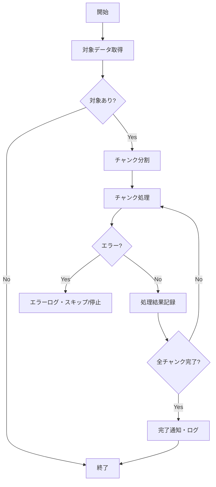

# DSD-006 バッチ・非同期処理詳細設計書 テンプレート

> このドキュメントはバッチ処理・キュー・非同期ジョブを使用する機能のみ作成する。
> REQ-005 の当該機能にバッチ/非同期処理の記載がある場合に作成する。

## 目次
1. 処理一覧
2. 処理詳細
3. スケジュール設計
4. エラーハンドリング・冪等性
5. 監視・アラート
6. 後続フェーズへの影響

---

## セクション構成

```markdown
## 1. 処理一覧

| 処理ID | 処理名 | 種別 | トリガー | 優先度 |
|---|---|---|---|---|
| BATCH-001 | {バッチ処理名} | バッチ / 非同期キュー / スケジュール | スケジュール / イベント / 手動 | HIGH / MEDIUM / LOW |

---

## 2. 処理詳細

### 2.1 {処理ID}: {処理名}

**種別:** バッチ / 非同期キュー / Cron ジョブ
**目的:** {処理の目的・背景}

#### 2.1.1 スケジュール / トリガー

| 項目 | 値 |
|---|---|
| トリガー種別 | Cron スケジュール / イベント駆動（キュー） / 手動実行 |
| Cron 式（スケジュール実行の場合） | `0 2 * * *`（毎日 02:00 UTC）|
| イベント（イベント駆動の場合） | `{event_name}` が発行された時 |
| タイムゾーン | Asia/Tokyo |
| 想定実行時間 | {X}分以内 |

#### 2.1.2 処理フロー



**処理ステップ:**
| ステップ | 処理内容 | 備考 |
|---|---|---|
| 1 | 処理対象レコードを取得 | ステータス条件・最終処理日時でフィルタ |
| 2 | チャンク分割（{N}件/チャンク） | メモリ使用量を制御 |
| 3 | 各チャンクを処理 | トランザクション境界はチャンク単位 |
| 4 | 処理結果をDBに記録 | 成功/失敗・処理日時を更新 |
| 5 | 完了ログ・通知 | 処理件数・エラー件数を記録 |

#### 2.1.3 入出力

**入力:**
| データ | 取得元 | 条件 |
|---|---|---|
| 処理対象レコード | `{table_name}` | `status = 'pending' AND scheduled_at <= NOW()` |

**出力:**
| データ | 書き込み先 | 内容 |
|---|---|---|
| 処理結果 | `{table_name}` | `status`, `processed_at`, `error_message` 更新 |
| 実行ログ | `batch_logs` テーブル / ログファイル | 実行日時・処理件数・エラー件数 |

#### 2.1.4 トランザクション設計

| 境界 | 範囲 | 分離レベル |
|---|---|---|
| 外側トランザクション | 対象データの取得・ロック | READ COMMITTED |
| 内側トランザクション | チャンク単位の更新 | READ COMMITTED |

**悲観的ロック（バッチ多重実行防止）:**
```sql
SELECT * FROM {table_name}
WHERE status = 'pending'
FOR UPDATE SKIP LOCKED
LIMIT {chunk_size};
```

---

## 3. スケジュール設計

| 処理ID | Cron 式 | 実行時刻（JST） | 最大実行時間 | 多重実行防止 |
|---|---|---|---|---|
| BATCH-001 | `0 2 * * *` | 毎日 11:00 | 30分 | DB排他ロック |
| BATCH-002 | `0 */6 * * *` | 6時間毎 | 10分 | Redis 分散ロック |

**注意:** バッチ処理は業務影響が低い時間帯（深夜〜早朝）にスケジュールする。

---

## 4. エラーハンドリング・冪等性

### 4.1 エラー処理方針

| エラー種別 | 対処 | 処理継続 |
|---|---|---|
| 単一レコードのビジネスエラー | エラーログ記録・そのレコードをスキップ | 継続 |
| DB接続エラー | エラーログ・アラート通知・処理中断 | 中断 |
| 外部API エラー | リトライ（最大3回）→失敗時スキップ・ログ | スキップして継続 |
| メモリ不足・タイムアウト | エラーログ・アラート・処理中断 | 中断 |

### 4.2 冪等性の設計

**冪等性を保証する仕組み:**
- 処理済みフラグ（`status` / `processed_at`）を確認してから処理開始
- `SKIP LOCKED` によって多重実行時の二重取得を防止
- 処理結果の記録はべき等（何度実行しても同じ結果になるUPSERT）

**リラン（再実行）手順:**
1. 再処理対象のレコードを `status = 'pending'` にリセット
2. バッチを手動実行

### 4.3 デッドレター処理

- 最大リトライ回数超過レコードを `status = 'failed'` に更新
- `{dead_letter_table}` テーブルに移動（あるいはフラグ管理）
- 翌営業日に担当者がレビュー・手動対応

---

## 5. 監視・アラート

| 監視項目 | 閾値 | アラート先 |
|---|---|---|
| バッチ未完了（タイムアウト） | 想定実行時間の150%超過 | Slack #alerts |
| エラー率 | 処理件数の5%超 | Slack #alerts |
| 処理件数が0件 | 0件 | Slack #batch-monitor |
| 連続失敗 | 3回連続でエラー終了 | メール通知 |

---

## 6. 後続フェーズへの影響

| 影響先 | 内容 |
|---|---|
| IMP-001_{FEAT-ID} | バッチ/ジョブ実装 |
| UT-001_{FEAT-ID} | バッチ処理の単体テスト（冪等性・エラー系含む） |
| OPS-001 | 定期バッチの運用監視手順 |
| OPS-002 | バッチ失敗時の障害対応手順 |
```
