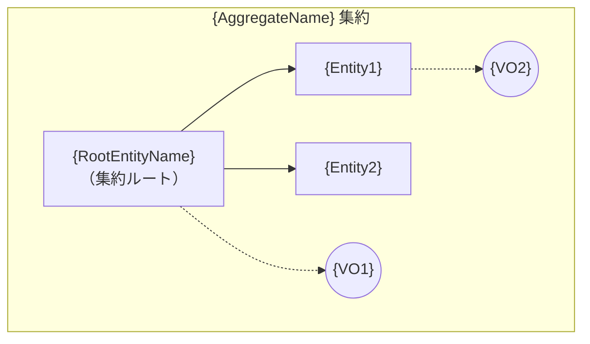
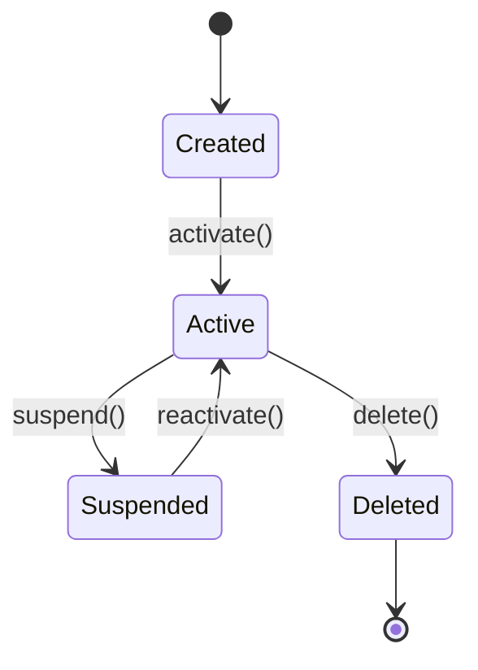
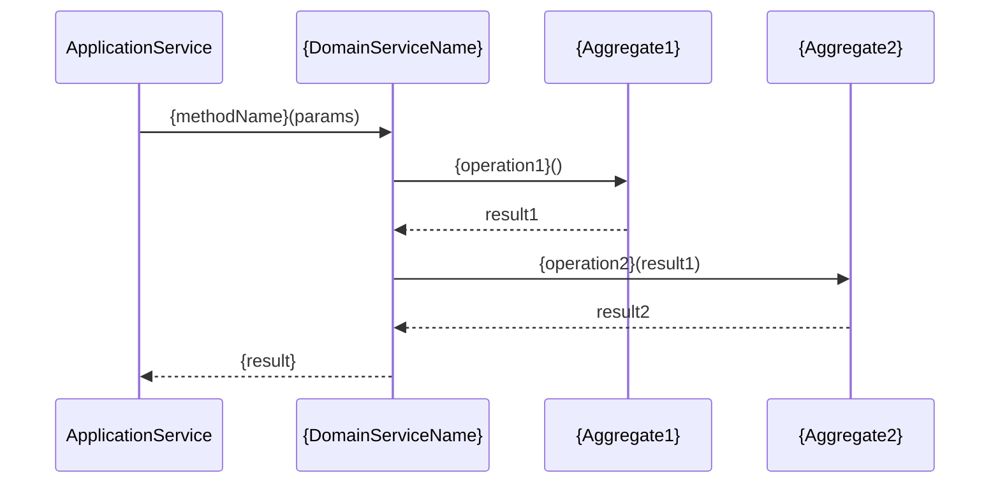

# DSD-009 ドメインモデル詳細設計書（DDD 戦術設計）テンプレート

> このドキュメントは機能別（FEAT-ID単位）。
> 保存先: `docs/DSD/FEAT-{NNN}_{機能名}/DSD-009_{FEAT-ID}_{機能名}.md`
> 入力元: BSD-009, BSD-010, REQ-005

## 目次
1. コンテキスト配置
2. 集約設計
3. エンティティ定義
4. 値オブジェクト定義
5. ドメインサービス定義
6. リポジトリインターフェース定義
7. ドメインイベント定義
8. 腐敗防止層（ACL）
9. 後続フェーズへの影響

---

## セクション構成

```markdown
## 1. コンテキスト配置

### 1.1 所属コンテキスト

| 項目 | 値 |
|---|---|
| FEAT-ID | {FEAT-NNN} |
| 機能名 | {機能名} |
| 所属コンテキスト | {BSD-009 で定義されたコンテキスト名} |
| コンテキストID | CTX-XXX |
| サブドメイン分類 | コア / サポーティング / ジェネリック |

### 1.2 依存コンテキスト

| 依存先コンテキスト | 統合パターン | 依存方向 | 依存内容 |
|---|---|---|---|
| CTX-YYY | Customer-Supplier / ACL / etc. | 上流 / 下流 | {依存するデータ・サービス} |

---

## 2. 集約設計

### 2.1 集約一覧

| 集約名 | 集約ルート | 含有エンティティ | 含有値オブジェクト | 一貫性境界 |
|---|---|---|---|---|
| {AggregateA} | {RootEntity} | {Entity1, Entity2} | {VO1, VO2} | {トランザクション境界の説明} |

### 2.2 集約詳細: {AggregateName}

**集約ルート**: `{RootEntityName}`
**一貫性境界**: {このトランザクション内で保証する不変条件}

**一貫性境界図:**



**不変条件:**
| 不変条件ID | 不変条件 | 検証タイミング | 違反時の振る舞い |
|---|---|---|---|
| INV-001 | {不変条件の記述} | {作成時 / 更新時 / 常時} | {例外スロー / 操作拒否} |

（集約数分繰り返す）

---

## 3. エンティティ定義

### 3.1 {EntityName}

**役割**: {エンティティの責務}
**集約**: {所属する集約名}
**集約ルート**: はい / いいえ

#### ID 戦略

| 項目 | 値 |
|---|---|
| ID型 | UUID / ULID / 連番 |
| 生成方式 | アプリケーション生成 / DB生成 |
| 一意性スコープ | グローバル / 集約内 |

#### 属性

| 属性名 | 型 | 必須 | 説明 | ドメインルール |
|---|---|---|---|---|
| `id` | {ID型} | Yes | 一意識別子 | |
| `name` | `Name`（値オブジェクト） | Yes | 名称 | {バリデーションルール} |

#### ライフサイクル状態遷移



| 状態 | 説明 | 許可される操作 |
|---|---|---|
| Created | 初期状態 | activate |
| Active | 有効状態 | update, suspend, delete |
| Suspended | 一時停止 | reactivate, delete |
| Deleted | 削除済み | なし |

#### ビジネスルール

| ルールID | ルール | 実装メソッド |
|---|---|---|
| BR-001 | {ビジネスルールの記述} | `{methodName}()` |

（エンティティ数分繰り返す）

---

## 4. 値オブジェクト定義

### 4.1 {ValueObjectName}

**用途**: {値オブジェクトが表現するドメイン概念}
**使用箇所**: {使用するエンティティ・集約}

#### 属性

| 属性名 | 型 | 説明 | 制約 |
|---|---|---|---|
| `value` | string / number / etc. | | {制約の記述} |

#### 等価性
- 等価判定基準: {全属性の値が一致する場合に等価}

#### 不変性
- オブジェクト生成後は属性値の変更不可
- 変更が必要な場合は新しいインスタンスを生成する

#### ファクトリメソッド

| メソッド名 | 引数 | 戻り値 | バリデーション | 説明 |
|---|---|---|---|---|
| `create(value)` | `value: {型}` | `{VOName}` | {バリデーション内容} | 新規生成 |
| `reconstruct(value)` | `value: {型}` | `{VOName}` | なし（永続化からの復元用） | DBからの復元 |

#### テスト観点
- 有効な値での生成が成功すること
- 無効な値での生成がエラーになること
- 等価性が正しく判定されること
- 不変性が保証されること

（値オブジェクト数分繰り返す）

---

## 5. ドメインサービス定義

### 5.1 {DomainServiceName}

**責務**: {このサービスの責務。複数の集約にまたがるビジネスロジック等}
**使用理由**: {エンティティ単体では表現できない理由}

#### メソッドシグネチャ

| メソッド名 | 引数 | 戻り値 | 説明 |
|---|---|---|---|
| `{methodName}` | `{param}: {Type}` | `{ReturnType}` | {処理の説明} |

#### オーケストレーションフロー



（ドメインサービス数分繰り返す。不要な場合は「該当なし」と記載）

---

## 6. リポジトリインターフェース定義

### 6.1 {AggregateRepository}

**対象集約**: {AggregateName}
**集約ルートエンティティ**: {RootEntityName}

#### メソッド一覧

| メソッド名 | 引数 | 戻り値 | 説明 |
|---|---|---|---|
| `findById(id)` | `id: {ID型}` | `{AggregateRoot} \| null` | ID による集約の取得 |
| `save(aggregate)` | `aggregate: {AggregateRoot}` | `void` | 集約の永続化（新規作成・更新を統合） |
| `delete(aggregate)` | `aggregate: {AggregateRoot}` | `void` | 集約の削除 |
| `findBy{Criteria}(...)` | `{criteria}: {Type}` | `{AggregateRoot}[]` | 条件による検索 |

#### クエリ仕様

| クエリ名 | 条件 | ソート | ページネーション | 用途 |
|---|---|---|---|---|
| `findBy{Criteria}` | {検索条件} | {ソート条件} | あり / なし | {用途} |

#### DSD-004 テーブルマッピング

| ドメインオブジェクト | マッピング先テーブル | マッピング方式 |
|---|---|---|
| {AggregateRoot} | `{root_table}` | 1:1 |
| {ChildEntity} | `{child_table}` | 1:N（親テーブルに FK） |
| {ValueObject} | `{root_table}.{column}` | 埋め込み（カラム） |

（リポジトリ数分繰り返す）

---

## 7. ドメインイベント定義

### 7.1 {DomainEventName}

**イベント名**: `{EventName}`（例: `OrderPlaced`, `UserRegistered`）

| 項目 | 値 |
|---|---|
| 発行元集約 | {AggregateName} |
| 発行トリガー | {操作名・条件} |
| 購読先コンテキスト | CTX-XXX, CTX-YYY |
| 整合性保証 | 少なくとも1回配信 / 正確に1回配信 |

#### ペイロード

| フィールド名 | 型 | 必須 | 説明 |
|---|---|---|---|
| `eventId` | UUID | Yes | イベント一意ID |
| `occurredAt` | DateTime | Yes | イベント発生日時 |
| `aggregateId` | {ID型} | Yes | 発行元集約のID |
| `{field}` | {型} | | {説明} |

#### 購読側の処理

| 購読先 | 処理内容 | 冪等性保証 | 失敗時の振る舞い |
|---|---|---|---|
| CTX-XXX | {処理の概要} | {冪等キー: eventId} | {リトライ / DLQ} |

（ドメインイベント数分繰り返す。不要な場合は「該当なし」と記載）

---

## 8. 腐敗防止層（ACL）

### 8.1 外部システムマッピング

| 外部システム | 外部モデル | 内部ドメインモデル | 変換方向 |
|---|---|---|---|
| {システム名} | {外部の型・構造} | {内部の型・構造} | 入力 / 出力 / 双方向 |

### 8.2 変換ロジック

#### {外部システム名} アダプタ

**変換方向**: 入力（外部→内部） / 出力（内部→外部）

| 外部フィールド | 内部フィールド | 変換ルール |
|---|---|---|
| `{external_field}` | `{internal_field}` | {変換ルール: 型変換・値マッピング等} |

### 8.3 アダプタインターフェース

| インターフェース名 | メソッド | 引数 | 戻り値 | 説明 |
|---|---|---|---|---|
| `{AdapterInterface}` | `{method}` | `{外部型}` | `{内部型}` | {変換処理の概要} |

（外部システム連携がない場合は「該当なし - 外部システム連携なし」と記載）

---

## 9. 後続フェーズへの影響

| 影響先 | 内容 |
|---|---|
| DSD-001_{FEAT-ID} | ドメイン層のエンティティ・値オブジェクト・サービスの実装クラス設計。アプリケーション層・インフラ層はこのドキュメントのドメインモデルを前提とする |
| DSD-004_{FEAT-ID} | 集約-テーブルマッピングに基づくテーブル詳細定義・値オブジェクトのカラムマッピング |
| DSD-008_{FEAT-ID} | ドメイン層の単体テスト設計（集約不変条件テスト・値オブジェクトテスト・ドメインサービステスト・ドメインイベントテスト） |
| IMP-001_{FEAT-ID} | TDD 実装のドメイン層テストケースの起点 |
```
